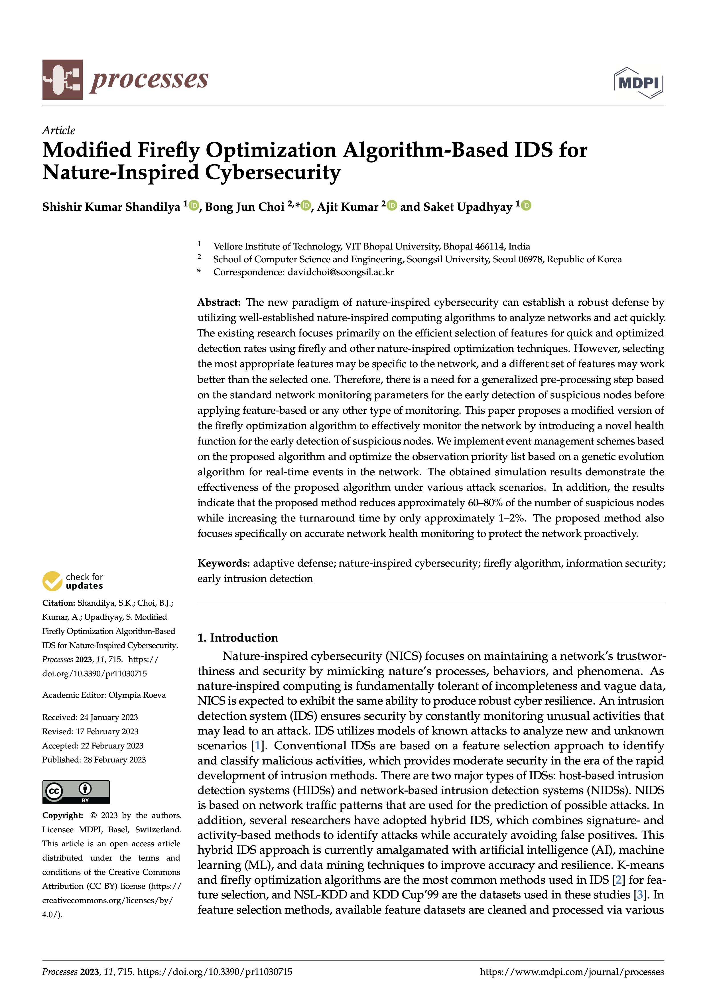

# Paper

Get the [PDF](https://saketupadhyay.com/rpapers/pdfs/saketfirefly.pdf), or visit MDPI on [WEB](https://www.mdpi.com/2227-9717/11/3/715).

```bibtex
@Article{pr11030715,
AUTHOR = {Shandilya, Shishir Kumar and Choi, Bong Jun and Kumar, Ajit and Upadhyay, Saket},
TITLE = {Modified Firefly Optimization Algorithm-Based IDS for Nature-Inspired Cybersecurity},
JOURNAL = {Processes},
VOLUME = {11},
YEAR = {2023},
NUMBER = {3},
ARTICLE-NUMBER = {715},
URL = {https://www.mdpi.com/2227-9717/11/3/715},
ISSN = {2227-9717},
ABSTRACT = {The new paradigm of nature-inspired cybersecurity can establish a robust defense by utilizing well-established nature-inspired computing algorithms to analyze networks and act quickly. The existing research focuses primarily on the efficient selection of features for quick and optimized detection rates using firefly and other nature-inspired optimization techniques. However, selecting the most appropriate features may be specific to the network, and a different set of features may work better than the selected one. Therefore, there is a need for a generalized pre-processing step based on the standard network monitoring parameters for the early detection of suspicious nodes before applying feature-based or any other type of monitoring. This paper proposes a modified version of the firefly optimization algorithm to effectively monitor the network by introducing a novel health function for the early detection of suspicious nodes. We implement event management schemes based on the proposed algorithm and optimize the observation priority list based on a genetic evolution algorithm for real-time events in the network. The obtained simulation results demonstrate the effectiveness of the proposed algorithm under various attack scenarios. In addition, the results indicate that the proposed method reduces approximately 60–80% of the number of suspicious nodes while increasing the turnaround time by only approximately 1–2%. The proposed method also focuses specifically on accurate network health monitoring to protect the network proactively.},
DOI = {10.3390/pr11030715}
}

```


